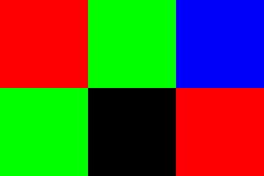

# Image Manipulator
This executable works with images in PPM format, as well as a custom format called SBU.

> [!IMPORTANT]
> This project was originally written on a Linux distribution, and so to successfully compile it on Windows, [this code](https://gist.github.com/superwills/5815344) was imported. All credit for `getopt.c` and `getopt.h` goes to the original source.

### Features:
- Copy a section of the image, and paste it somewhere else!
- Write text with different font options onto the image!

### Document Sections:
- [PPM File Format](#ppm-p3-format)
- [SBU File Format](#sbu-format)
- [Font File Format](#font-file-format)
- [Using the Executable](#using-the-executable)
- [Specific Flags](#specific-flags)

> [!TIP]
> Sample fonts and images are available for use within `tests.zip` in the releases section!

## PPM (P3) Format
File extension: `.ppm`

File structure:
- Starts with P3 to indicate the variant of PPM used in this program
- Line 2 indicates the width and height of the image in pixels
- Line 3 indicates the max value of a color component, which is assumed to be always 255 in this program
- Lines 4+ contain the data of the image:
    - Each pixel is represents by an RGB code made up of three numbers (0-255)
    - *Therefore the amount of columns is the amount of numbers in the line divided by 3*
    - A new line indicates the start of a new row of pixels

Example:
```
P3
3 2
255
255 0 0 0 255 0 0 0 255
0 255 0 0 0 0 255 0 0
```


## SBU Format
File extension: `.sbu`

File structure:
- Starts with SBU
- Line 2 indicates the width and height of the image in pixels
- Line 3 indicates the amount of entries in the color "table" in the next line
- Line 4 contains all the RGB values for the colors used in the image:
    - The amount of color entries must match the number given in line 3!
- Line 5 contains one* number for each pixel in the image
    - This number is simply the index of the color in the color table
    - When to move to the next row is calculated by the program using the given width, so all the pixel data is stored in line 5

> [!NOTE]
> The SBU format uses run-length encoding for line 5! This means if there are 5 consecutive pixels that use color 2, then instead of `2 2 2 2 2`, it is represented as `*5 2`! *(This only applies to 2+ consecutive pixels)*

Example: 
```
SBU
3 2
4
255 0 0 0 255 0 0 0 255 0 0 0
0 1 2 1 3 0
```


## Font File Format
Each font file contains letters A-Z. Each letter is a group of asterisks and spaces with a rectangular "boundary", and is separated from the next letter by a column of spaces.

Example of A and B:
```
 **  **** 
*  * *   *
**** **** 
*  * *   *
*  * **** 
```
Note the column of spaces in between the letters.

### Font Scaling:
This G is the original G within the font file, and therefore its font size is 1:
```
 ****** 
**      
**   ***
**    **
 ****** 
```
When scaling the font size, each row and column are multiplied by the font size given. For example, this is the same G with a font size of 2:
```
  ************  
  ************  
****            
****            
****      ******
****      ******
****        ****
****        ****
  ************  
  ************  
```

> [!NOTE]
> Font scaling is automatically handled by the program when you specify the font size in the `-r` flag arguments!

# Using the Executable

Download `ImageManipulator.exe` from [here](https://github.com/dylanNicastro/image-manipulator/releases/latest)

> [!WARNING]
> Image Manipulator gets input from command-line arguments, so you must launch it from a terminal, not by double-clicking.

## Command-line Syntax:
```
.\ImageManipulator.exe -i PATH -o PATH [-c ARGS] [-p ARGS] [-r ARGS]
```

> [!WARNING]
> - `-i` and `-o` are required flags, but `-c`, `-p`, and `-r` are optional flags.
>
> - `-p` can only be used if `-c` is also used.
>
> - Flags cannot be used twice (e.g. the command below is invalid)
> ```
> .\ImageManipulator.exe -i PATH -i PATH -o PATH
> ```

## Specific Flags:
### `-i PATH`
- `PATH`: Indicates the path to the PPM or SBU image to be taken as input

Example: `-i .\tests\images\desert.ppm`

---

### `-o PATH`
- `PATH`: Indicates the path where the resulting image should be saved

Example: `-i .\output.sbu`

---

### `-c ROW,COL,WIDTH,HEIGHT`
- `ROW`: Indicates the row to start copying at (0 is the topmost row)
- `COL`: Indicates the column to start copying at (0 is the leftmost column)
- `WIDTH`: Indicates the amount of pixels in each row to copy (Starts at `COL` then goes to the right)
- `HEIGHT`: Indicates the amount of pixels in each column to copy (Starts at `ROW` then goes down)

Example: `-c 10,20,100,50`

> [!CAUTION]
> The four arguments to `-c` are all mandatory, and they must be separated by commas only, **not spaces!**

---

### `-p ROW,COL`
- `ROW`: Indicates the row to start pasting at (will paste downwards from this row)
- `COL`: Indicates the column to start pasting at (will paste to the right from this column)

Example: `-p 50,40`

> [!CAUTION]
> The two arguments to `-p` are all mandatory, and they must be separated by commas only, **not spaces!**

---

### `-r MSG,PATH,SIZE,ROW,COL`
- `MSG`: The message to be written on the image, given in double quotation marks
- `PATH`: Indicates the path where the font file can be found, given in double quotation marks
- `SIZE`: An integer that indicates the size multiplier of the text to be written (valid range is 1-10)
- `ROW`: Indicates the row to start writing at (will write downwards from this row)
- `COL`: Indicates the column to start writing at (will write to the right from this column)

Example: `-r "Hello, World!",".\tests\fonts\font1.txt",1,50,50`

> [!CAUTION]
> The five arguments to `-r` are all mandatory, and they must be separated by commas only, **not spaces!**
